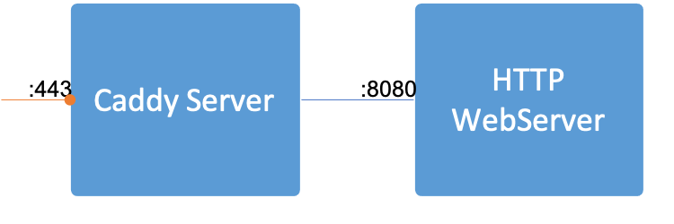

# Using caddy as reverse proxy for webserver(nginx)

## Basic setup

假设当前宿主机ip地址(10.0.0.5)

首先启动web服务器(将主机的8080映射到nginx的80)

	docker run -p 8080:80 ... nginx

caddy将对主机的8080进行反向代理(Caddyfile内容如下,local web server)

	localhost, 10.0.0.5 {
			reverse_proxy /* localhost:8080
	}

- 当访问主机(10.0.0.5)的80端口和443端口)时,就会被caddy代理到主机的8080
- 由于主机的8080端口映射到了nginx的80端口,所以最终实现访问到nginx

启动caddy容器

	docker run --rm -it --network host -v $PWD/Caddyfile:/etc/caddy/Caddyfile caddy

使用curl或wget测试

	curl -k https://localhost
	wget -qO - --no-check-certificate https://localhost/script/utils

如果是public-facing(www.myweb.com) web server则Caddyfile配置如下

	www.myweb.com {
			reverse_proxy /* localhost:8080
	}

## Certificate Authority(CA)

生成对应的CA证书和key(localhost+1.pem和localhost+1-key.pem)

	mkdir certs && cd certs
	mkcert localhost 10.0.0.5

修改Caddyfile配置对应的证书文件

	localhost, 10.0.0.5 {
			reverse_proxy /* localhost:8080
			tls /certs/localhost+1.pem  /certs/localhost+1-key.pem
	}

启动容器时配置证书

	docker run --name rproxy --rm -d --network host -v $PWD/certs:/certs -v $PWD/Caddyfile:/etc/caddy/Caddyfile caddy
